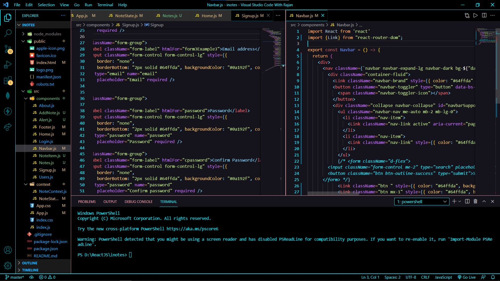

<h1 align="center">
  Bharti Theme for VS Code
</h1>

## This is the Bharti theme made for your VS Code 
 >                            Rajan Kumar
 

  

  A minimal, dark theme for <a href="https://marketplace.visualstudio.com/items?itemName=Rajankumar.bharti-theme">VS Code</a>.

## Installation via VS Code

1. Open **Extensions** sidebar panel in VS Code. `View → Extensions`
2. Search for `Bharti`
3. Click on **Bharti Theme** 
4. Click **Install** to install it
5. Click **Reload** to reload the editor
6. Code > Preferences > Color Theme > **Halcyon**

## Facing Installation Problem 

Read the [VSC Extension Guide](https://code.visualstudio.com/docs/editor/extension-marketplace)

### Contact with me 
* [My linkedIn](https://www.linkedin.com/in/krcpr007/)
* [My GitHub](https://github.com/krcpr007)

**Happy Coding <3**
